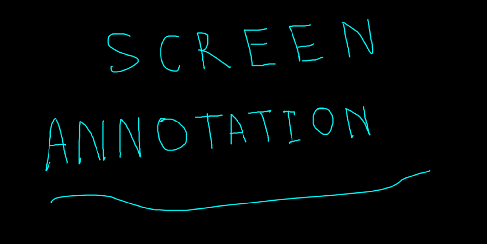

# Annotate - Screen Annotate



The Annotate application is a screen annotation tool that allows users to draw directly over their screen without changing the content. It supports native desktop overlays on Linux, macOS, and Windows, with web and mobile versions without native overlay window support.

## Why this exists

Screen annotation usually means changing windows or opening a separate drawing tool or dealing with complex features, but Screen Annotate makes simple drawing and annotation easy on top of any screen.

There are many screen annotation or drawing tools available, but those work within limited boundaries and a single window. They draw on their own canvas or recording and sharing screen is never captured, and only the drawing is kept.

This application was made for simplicity. Toggle F8 to show or hide it, hold Alt or Shift and move the mouse to draw or erase, and hold a letter from A to Z and move the mouse to draw in a favorite color, while keeping the native feel on desktop and simplicity for cross-platforms including mobile friendly.

For the full list, see [Keyboard Shortcuts](#keyboard-shortcuts).

## How it works

Open Screen Annotate once and leave it running. F8 does the rest.

1. Press F8 to show the see-through layer over the screen.
2. Drag to draw. Hold Shift and drag to erase.
3. Press Ctrl+V to paste an image or text. Press A to Z to change the color.
4. Press Ctrl+N when a separate blank canvas is wanted.
5. Press F8 again to hide the layer. The drawing is still there next time.

> The mouse draws on the layer. The app underneath stays on screen but cannot be clicked until F8 takes the layer away.
>
> Ctrl+F8 closes Annotate for good, and the drawing goes with it. Nothing is saved, nothing is sent. No account, no internet, no waiting.

## Core Features

- **Overlay**: The see-through layer that sits above everything on screen.
- **Drawing**: Freehand strokes with a round brush.
- **Colors**: Press A to Z to pick one of 26 colors. R is red.
- **Erasing**: Hold Shift and drag, or right click and drag.
- **Undo**: Ctrl+Z or Backspace takes back the last stroke.
- **Clear**: Escape removes everything.
- **Paste**: Ctrl+V pastes images, text and rich text. Ctrl+Shift+V pastes plain text.
- **Move pasted items**: Hold Ctrl and drag.
- **Global keys**: F8 shows or hides the layer. Ctrl+F8 quits.
- **Blank canvas**: Ctrl+N opens a separate canvas with a background to pick.
- **Command line**: Show, hide, toggle and quit from any terminal.
- **Web and mobile**: The same drawing runs in a browser and installs on a phone.

## Supported Platforms

- **Web:** — Drawing, erase, colors, undo, clear, paste. No layer over the screen, no global keys.
- **Mobile:** — Same as Web, plus install and a touch toolbar. No global keys.
- **Linux:** — Full app. On Wayland, F8 needs GNOME or gsettings, so use the deb.
- **macOS:** — Full app, dmg and zip. The toggle helper joins login items. x64 only.
- **Windows:** — Full app, installer and portable exe. F8 binds directly.

## Installation

### Prerequisites

- **Web:** — Any current browser with Canvas 2D and Pointer Events. Nothing to install.
- **Mobile:** — Mobile browsers show an install prompt. On iOS use Share, then Add to Home Screen. No global keys in a browser.
- **Linux:** — A desktop on X11 or Wayland. On Wayland the F8 binding needs GNOME or a desktop with gsettings. The .deb installs to /opt/Screen Annotate and links /usr/bin/annotate.
- **macOS:** — A macOS release the bundled Electron supports. The toggle helper is added to the login items on first run.
- **Windows:** — Windows 10 or newer.

### Downloads

| Platform | Downloads & Access                                                                                                                                                                                                 |
| -------- | ------------------------------------------------------------------------------------------------------------------------------------------------------------------------------------------------------------------ |
| Web      | [Live Preview](https://saeedhosan.github.io/annotate)                                                                                                                                                              |
| Mobile   | [Install from the web](https://saeedhosan.github.io/annotate)                                                                                                                                                      |
| Linux    | [`.deb`](https://github.com/saeedhosan/annotate/releases/download/v1.0.0/annotate_1.0.0_amd64.deb) · [`.AppImage`](https://github.com/saeedhosan/annotate/releases/download/v1.0.0/annotate-1.0.0-x86_64.AppImage) |
| macOS    | [`.dmg`](https://github.com/saeedhosan/annotate/releases/download/v1.0.0/annotate-1.0.0-x64.dmg) · [`.zip`](https://github.com/saeedhosan/annotate/releases/download/v1.0.0/annotate-1.0.0-x64.zip)                |
| Windows  | [Installer](https://github.com/saeedhosan/annotate/releases/download/v1.0.0/annotate-setup-1.0.0.exe) · [Portable](https://github.com/saeedhosan/annotate/releases/download/v1.0.0/annotate-1.0.0-portable.exe)    |

Linux is x64, macOS is x64 (Intel), Windows is x64. Other builds live on the [releases page](https://github.com/saeedhosan/annotate/releases).

Pushing a v* tag builds all three desktop installers and publishes them. The web preview ships from main.

### Installation Guide

#### Linux

AppImage:

1. Download [annotate-1.0.0-x86_64.AppImage](https://github.com/saeedhosan/annotate/releases/download/v1.0.0/annotate-1.0.0-x86_64.AppImage).
2. `chmod +x annotate-1.0.0-x86_64.AppImage`, then run it.
3. Press F8 for the layer, Ctrl+F8 to quit.

Debian and Ubuntu:

1. Download [annotate_1.0.0_amd64.deb](https://github.com/saeedhosan/annotate/releases/download/v1.0.0/annotate_1.0.0_amd64.deb).
2. `sudo dpkg -i annotate_1.0.0_amd64.deb`.
3. The installer creates `/usr/bin/annotate` and registers the F8 and Ctrl+F8 GNOME bindings for the current user. The app registers them again on launch if needed.
4. Run `annotate toggle` from a terminal. Uninstalling removes the symlink.

#### macOS

1. Open [annotate-1.0.0-x64.dmg](https://github.com/saeedhosan/annotate/releases/download/v1.0.0/annotate-1.0.0-x64.dmg).
2. Drag Screen Annotate into Applications.
3. Launch it once so the toggle helper is registered.
4. F8 shows the layer, Ctrl+F8 quits. A zip is there when no install is wanted.

#### Windows

1. Run [annotate-setup-1.0.0.exe](https://github.com/saeedhosan/annotate/releases/download/v1.0.0/annotate-setup-1.0.0.exe). No install needed for the [portable build](https://github.com/saeedhosan/annotate/releases/download/v1.0.0/annotate-1.0.0-portable.exe).
2. Start Screen Annotate from the Start menu.
3. F8 toggles the layer, Ctrl+F8 quits.

#### Web

1. Open the web preview in any modern browser.
2. Drag to draw. Hold Shift to erase.
3. Ctrl+Z undoes, Escape clears, Ctrl+V pastes, A to Z pick colors.
4. The web preview is a smaller version. No layer over the screen, no global keys, no blank canvases.

#### Mobile

1. Open the web preview on a phone or tablet and accept the prompt. On iOS use Share, then Add to Home Screen.
2. Start it from the home screen for a full screen canvas.
3. On touch devices a toolbar shows up with eraser, colors, undo and fullscreen. Hold undo to clear everything.

## Usage Guide

### Keyboard Shortcuts

Ctrl is Command on macOS.

| Shortcut           | Action                         |
| ------------------ | ------------------------------ |
| `F8`               | Show or hide the layer         |
| `Ctrl+F8`          | Quit                           |
| `Ctrl+N`           | New blank canvas               |
| `A` - `Z`          | Pick a color. R is red         |
| `Alt` + drag       | Draw with the current color    |
| `Shift` + drag     | Erase                          |
| Right click + drag | Erase                          |
| `Ctrl` + drag      | Move a pasted item             |
| `Ctrl+V`           | Paste image, text or rich text |
| `Ctrl+Shift+V`     | Paste as plain text            |
| `Ctrl+Z`           | Undo the last stroke           |
| `Backspace`        | Undo the last stroke           |
| `Escape`           | Clear everything               |

### Launching the application

Screen Annotate opens with the layer already up, so drawing can start right away. F8 takes it away and brings it back. On Linux, `annotate toggle` does the same from a terminal.

With the layer up, draw with the mouse, hold Shift to erase, press Ctrl+N for a separate canvas, and Ctrl+F8 to finish.

### Command-Line Interface

```bash
annotate toggle      # show or hide the layer
annotate show        # show the layer
annotate hide        # hide the layer
annotate quit        # quit
annotate --help      # list commands
annotate --agent     # background mode, owns the hotkeys
```

These talk to the app that is already running. `hide` keeps it alive so the next `show` is instant. If nothing is running, `toggle` and `show` start it. `--agent` only keeps the hotkeys. That is what the login item and the GNOME binding use.

## Development

### Prerequisites

- [Bun](https://bun.sh) 1.4 or newer. It runs the scripts and the tests.
- A display for Electron. Needed for the app and for the e2e tests.
- Git. For packaging, the usual Electron Builder requirements per platform.

### Setup and Runing

```bash
bun install
bun run dev
```

`bun run dev` runs three watchers. Vite builds the renderer, tsc builds the main process, and electronmon restarts Electron as soon as both are ready.

```bash
bun run start          # run the last build
bun run test           # everything: tsc, lint, unit, end to end
bun run test:unit      # unit and feature tests
bun run lint:write     # eslint and prettier, writes fixes
bun run test:e2e       # drives a real window over CDP
```

### Building

**Web**

```bash
bun run web:build       # static build into dist/renderer
bun run web:dev         # dev server
bun run web:serve       # build, then preview
```

**PWA**

```bash
bun run web:build       # same build, manifest and service worker included
```

The PWA is the web preview. The manifest gives it a standalone window and icons. The service worker makes it installable.

**Desktop**

```bash
bun run build:icon      # regenerate icons from assets/
bun run build           # renderer and main
```

**Build Installers**

```bash
bun run dist:linux
bun run dist:win
bun run dist:mac
```

Everything lands in `release/`:

- **Linux** - `annotate-1.0.0-<arch>.AppImage` and `annotate_1.0.0_<arch>.deb`.
- **Windows** - `annotate-setup-1.0.0.exe` and a portable `annotate-1.0.0-portable.exe`.
- **macOS** - `annotate-1.0.0-<arch>.dmg` and `annotate-1.0.0-<arch>.zip`.

### Project Structure

```text
annotate
├── src
│   ├── config      # app name, colors, shared shortcuts
│   ├── lib         # logger and helpers
│   ├── main        # Electron main process
│   │               #   Application, CommandLine, WindowManager,
│   │               #   ShortcutManager, IpcServer, commands
│   ├── renderer    # canvas UI, toolbar, paste, PWA assets
│   └── shared      # drawing model, no Electron, no DOM
├── tests           # unit tests and e2e tests
├── resources/linux # deb hooks and GNOME binding script
├── scripts         # icon generation
├── docs            # architecture and low level design
└── assets          # source icons
```

## Contributing

See [CONTRIBUTING.md](CONTRIBUTING.md). It covers setup, the checks to run, and the three code rules worth knowing.

## License

MIT. See [LICENSE](LICENSE).
